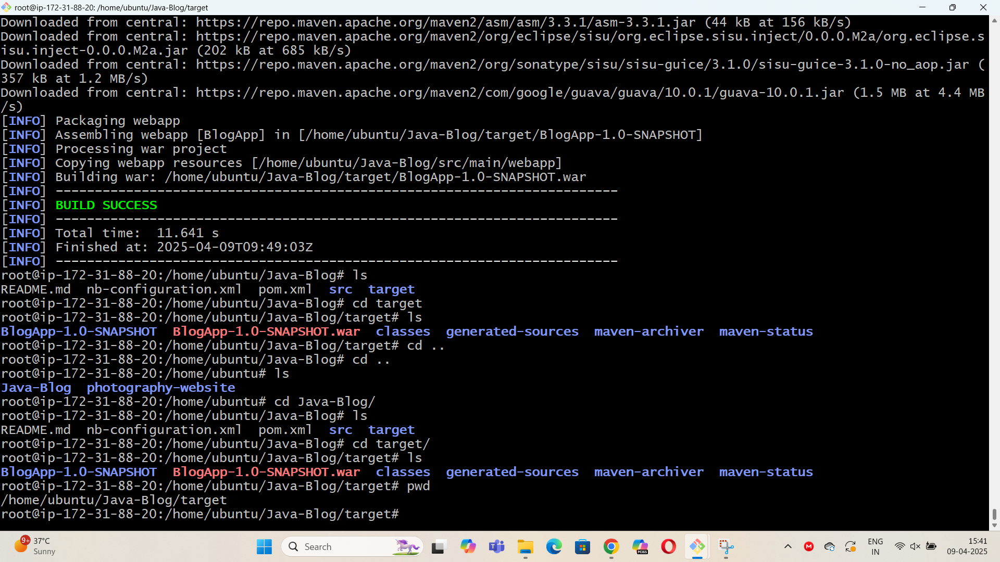
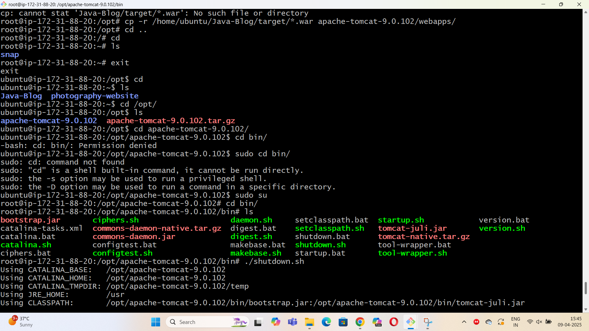
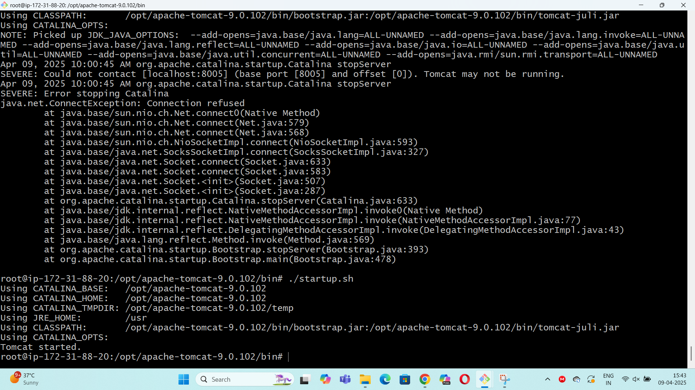
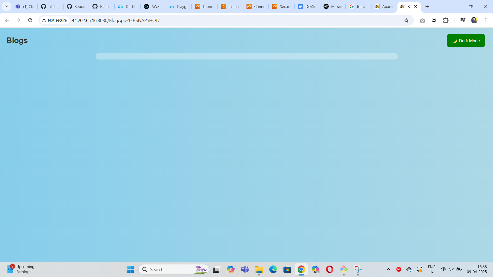
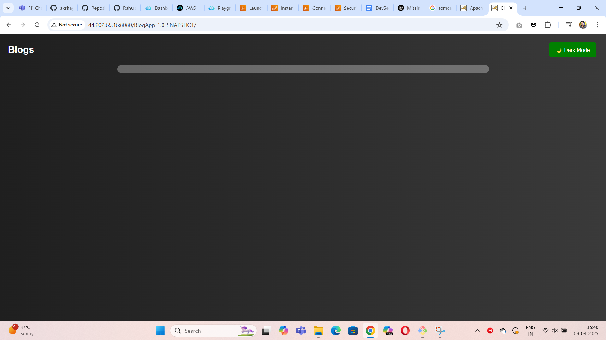

## Java Application Build and Deploy

### Git Repository:https://github.com/Rahuldepp/Java-Blog.git

#### Step1:Create a EC2 instance
#### Step2:Connect to terminal using ssh
#### Step3: Enter apt update
#### Step4: install java 
#### Step5: install maven
#### Step6: clone the git repository using git clone
#### Step7: build the code using mvn package
#### Step8: make sure build is success

#### Step9: install tomcat using linux

#### Step10: copy the war file from build to webapps folder in tomcat
#### Step11:use the public ip address:8080

#### Step12: Application should be live

