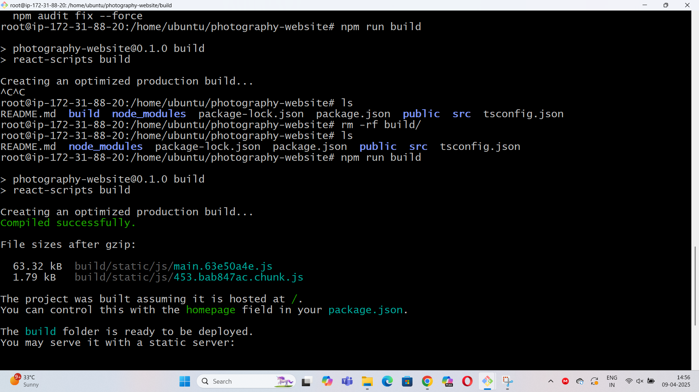
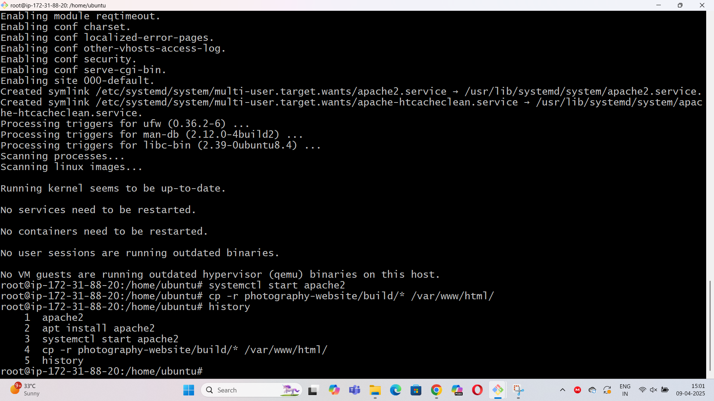

## Javascript Application Build and Deploy

### Git Repository:https://github.com/dreamz89/photography-website.git

#### Step1:Create a EC2 instance
#### Step2:Connect to terminal using ssh
#### Step3: Enter apt update
#### Step4: install nodejs 
sudo apt install nodejs

#### Step5: install npm
sudo apt install npm 

#### Step6: clone the git repository using git clone
git clone https://github.com/dreamz89/photography-website.git
#### Step7: build the code using npm run build
npm run build
#### Step8: make sure build folder created

#### Step9: install apache2 using linux
sudo apt install apache2
sudo systemctl start apache2 

#### Step10: replace the index.html file from build to /var/www/html folder in apache2
cp -r photography-website/build/* /var/www/html
#### Step11:use the public ip address
44.202.65.16
#### Step12: Application should be live

