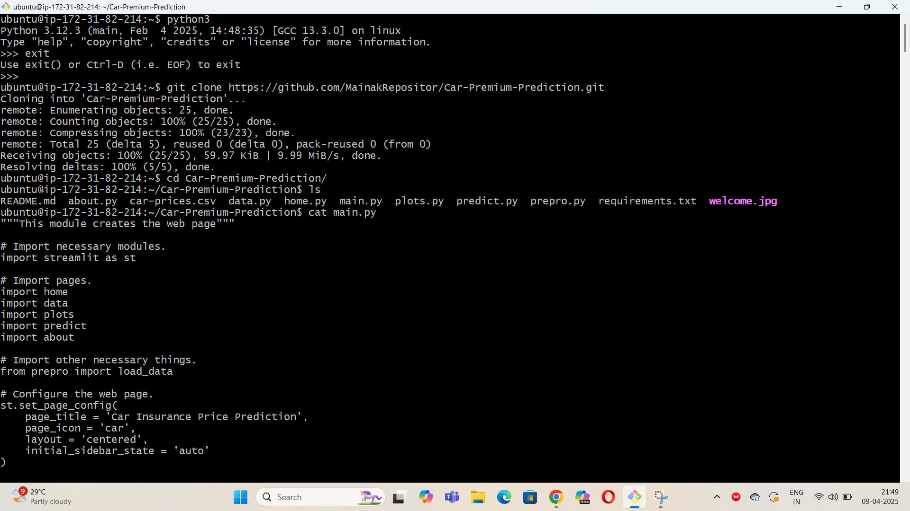
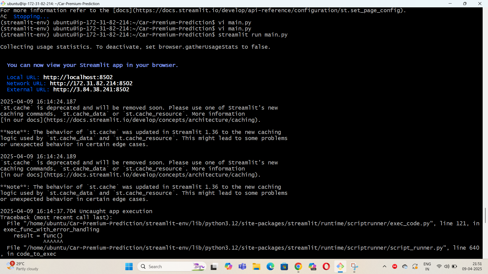
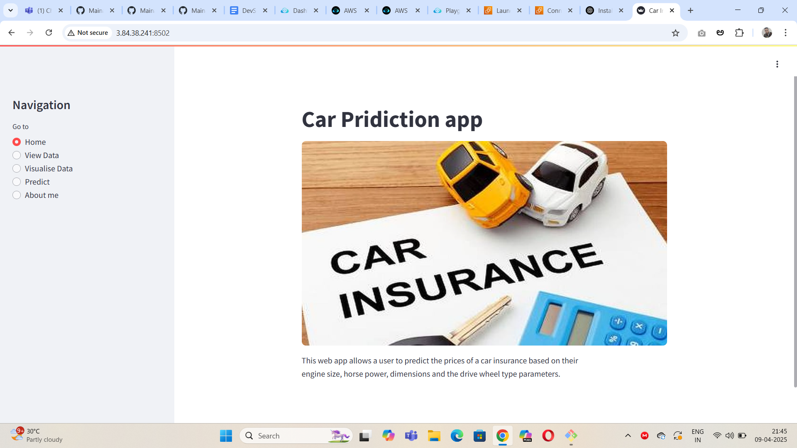
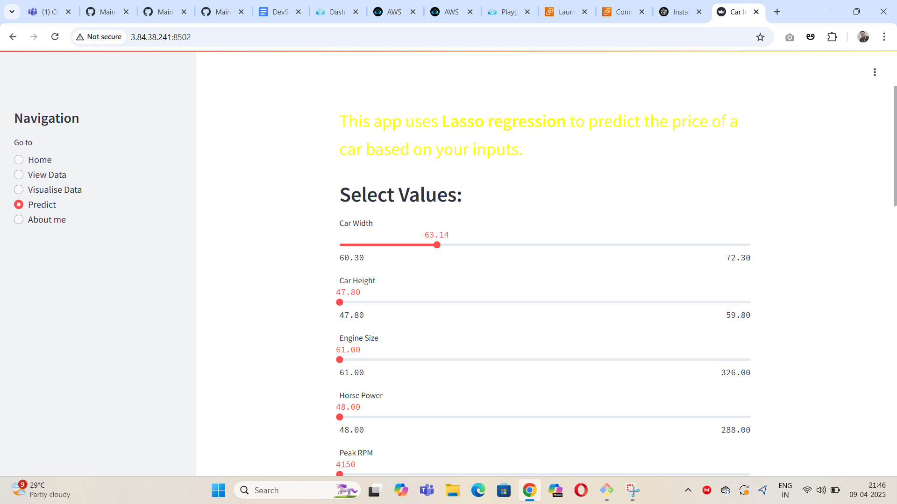
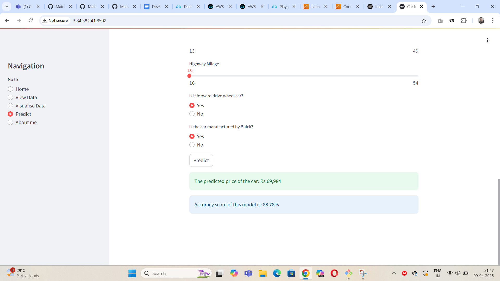

## Python Application Build and Deploy

### Git Repository:https://github.com/MainakRepositor/Car-Premium-Prediction.git

#### Step1:Create a EC2 instance
#### Step2:Connect to terminal using ssh
#### Step3: Enter apt update
#### Step4: install python3
python3 is inbuilt given in ubuntu just check for python version

#### Step5: install pip3,streamlit
sudo apt install python3-venv -y
python3 -m venv streamlit-env
source streamlit-env/bin/activate
pip install streamlit

#### Step6: clone the git repository using git clone
git clone https://github.com/MainakRepositor/Car-Premium-Prediction.git
cd Car-Premium-Prediction
#### Step7:run the python app using streamlit
streamlit run app.py

#### Step7: Application should be live
